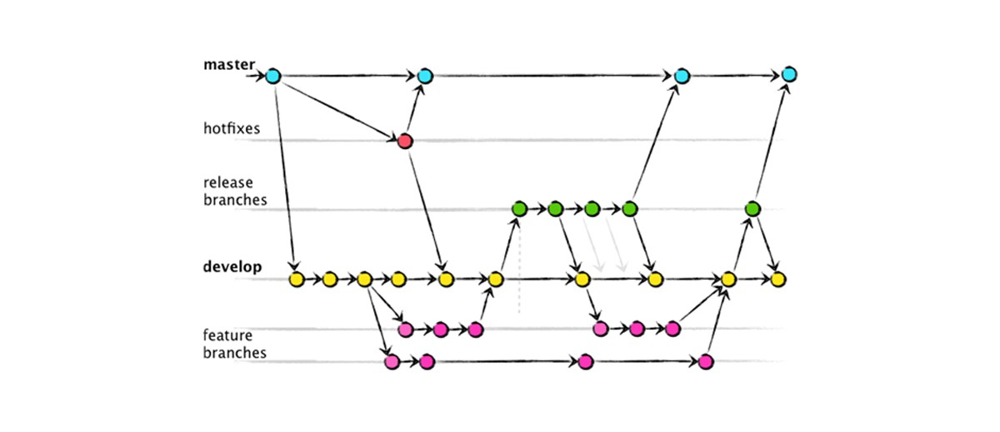

# Estudos sobre o Git


## O que é git  
O Git é um sistema de controle de revisão distribuído rápido, escalável e com um conjunto de comandos extraordinariamente ricos que fornecem operações de alto nível e acesso total aos internos.


## Entender o conceito do git  
Sistema de controle de revisão distribuído
 
## Diferenças entre Git e SVN  


## O que é o git-flow  
Criado pelo Vincent Driessen,

É um fluxo de trabalho, adotando nomenclaturas:  
`hotfixes`, `release-branches`, `develop`, `feature-branches`.


  


### Workflow :


#### 1:branch = 1:feature 

Cada alteração é feita via branch, seja HotFix/BugFix, novas funcionalides, ou até mesmo versões novas (diversas funcionalidades) tentando sempre manter a `master` atualizada e mantendo ciclos de deploy constante.  

**Prós:** Simples, Controle

**Problemas:** Equipes muito grandes podem gerar conflitos na master, não recomendado  o projeto não possua testes automatizados e processos de deploy, pois descobrir que o merge efetuado na master está bugado vai ser triste.
  


#### GitHub-Flow
Uma versão sem simplificada do Git-Flow, onde possui um bugfix 


**Prós:** Simples, Controle  
**Problemas:** Equipes muito grandes podem gerar conflitos na master, e descobrir que o merge não estão tão certo assim (e já está na master)   


## Comandos mais utilizados no dia a dia  


Efetua um clone (cria uma pasta na sua máquina com todos os arquivos que estão no servidor).
```bash
git clone https://github.com/gabrieldarezzo/estudos-git.git
```


Lista todos os arquivos que foram alterados.
```bash
git status
```

Exibe as modificações de um arquivo especifico, no caso do exemplo abaixo o `README.md`
```bash
git diff README.md
```

Envia todos os arquivos modificados para o stage.
```bash
git add .
```

Remove todos os arquivos que estão stage.
```bash
git reset 
```

Efetuar o commit das alterações que estão no stage.
```bash
git commit -m"Update variable STORE_PASS in .example.env" 
```

Envia para o repositório remoto os commits efetuados.
```bash
git push
```

Exibe todos os commits em ordem decrescente.
```bash
git log
```

Puxa toda as alterações que estão no repositório remoto.
```bash
git pull
```

Informa a branch atual com um (*), e lista todas que estão na sua maquina (repositório local).
```bash
git branch 
```

Limpa/Exclui todos as alterações efetuadas nos arquivos já existentes, alterando para o estado inicial da branch atual.
```bash
git checkout .
```

Cria uma branch (por default a partir da master), e aponta para ela.
```bash
git checkout -b feature/delete-user
```

Exclui uma branch local.
```bash
git branch -D feature/delete-user
```


## Comandos uteis que sao desconhecidos 
...


## O que é commit?
Um Commit é um pacote de alterações feitas no repositório.
Uma especie de PATH que é efetuada no código.
Exemplo de um commit: 


## O que é uma branch / Ramificação ? 
Ramificação no git é um ponteiro para as alterações feitas nos arquivos do projeto.
É útil em situações nas quais você deseja adicionar um novo recurso ou corrigir um erro, gerando uma nova ramificação garantindo que o código instável (inacabado) não seja mesclado nos arquivos do projeto principal. Depois de concluir a atualização dos códigos da ramificação, você pode mesclar (`merge`) a ramificação com a principal, geralmente chamada de `master`.


## Porque é necessário fazer o merge de uma branch no master?
Caso você tenha optador por criar uma branch.
E você densevolveu na branch: `feature/delete-user` após finalizar as alterações necessarias no código, você pode efetuar uma `merge` na `master` (mesclagem) garantindo assim que todos os commits entrem corretamente.

## Porque é importante usar boas mensagens em um commit?
Independente da pressa, preguiça ou até mesmo pressão.
Boas mensagens de commits podem ser uma documentação futura alem de trazer mais contexto pra quem revisa o código.

O commit possui dois parametros, exemplo:

```bash
git commit -m "Title" -m "Description"
```

### Exemplo ruim
```
First commit :hammer:
```

### Exemplo bom
```
Microserviço que exibe manipula informações pessoais do usuário.

Utilizado:
Laravel 5.7
Mysql 5.5.27
```

### Exemplo ruim
```
Remover regra do user.
```

### Exemplo bom
```
Ao atualizar o endereço na tela 'User' não verifica se 'user.active' para atualziar endereço cadastrado
```


## Referência

https://git-scm.com/book/en/v2  
https://git-scm.com/docs/gittutorial  
https://git-scm.com/docs/giteveryday  
https://receitasdecodigo.com.br/devops/git-o-que-e-um-branch
Entendendo GIT | (não é um tutorial!):  
https://www.youtube.com/watch?v=6Czd1Yetaac  
https://josiaspereira.com.br/como-escrever-uma-boa-mensagem-de-commit-no-git/

Git - git flow na prática:  
https://www.youtube.com/watch?v=wzxBR4pOTTs  

https://semver.org/  

